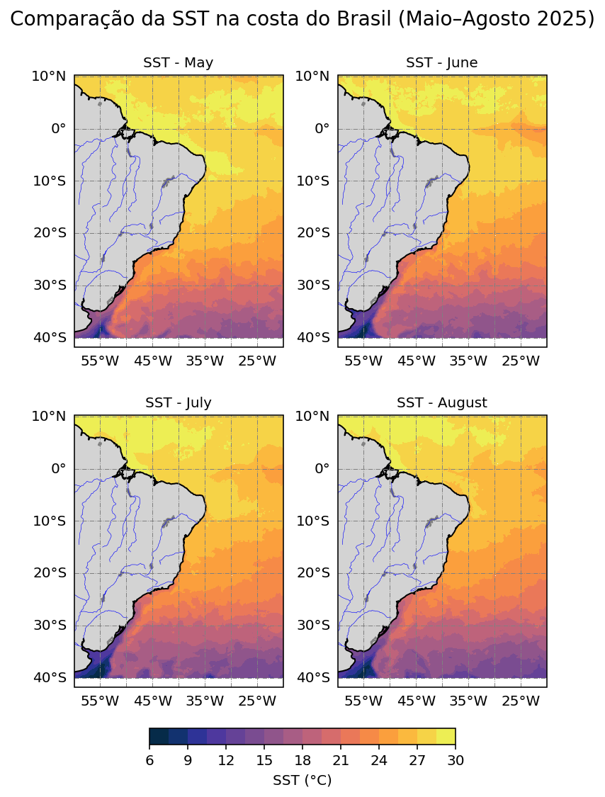

# Temperatura Superficial del Mar (SST) en la Costa de Brasil

Este repositorio contiene un script en **Python** que procesa archivos **NetCDF** con datos de temperatura superficial del mar (SST) provenientes del producto **GHRSST – REMSS L4**.  
El objetivo es realiar ejercicios de generación de mapas comparativos de SST en la costa de Brasil para los meses de mayo, junio, julio y agosto del año 2025.

---

## Descripción del ejercicio

El código realiza los siguientes pasos:

1. Abre múltiples archivos `.nc` correspondiente al día 29 de los meses entre mayo a agosto de 2025.  
2. Extrae la variable `analysed_sst` de cada uno de los datasets y convierte la temperatura de **Kelvin a grados Celsius (°C)**.  
3. Selecciona la región de interés que cubre la costa de **Brasil** (longitudes de `-60°` a `-20°`, latitudes de `-40°` a `10°`).  
4. Genera mapas usando: `contourf` para representar isolíneas de temperatura.
5. Crea mapas comparativos en una cuadrícula 2x2 con barras de color y escala térmica uniforme.

---
## Metodología
Para realizar este ejercicio se tomó la fuente de datos de temperatura superficial del mar provinientes del Remote Sensing Systems (RSS), diponibles en el siguiente enlace: data.remss.com. 

Las principales librerías utilizadas fueron:

- `xarray` : para abrir y manipular archivos NetCDF  
- `matplotlib` : para generar los gráficos  
- `cmocean` : para aplicar paletas de colores científicas (usadas comúnmente en oceanografía)  
- `cartopy` : para agregar proyecciones geográficas y líneas de costa  
- `numpy` y `calendar` : para operaciones numéricas y manejo de fechas
 
Y se sigue el siguiente proceso: 
1. Se abren los archivos `.nc` con `xarray`.
2. Se selecciona la variable `analysed_sst` y se convierte a grados Celsius (°C).
3. Se recorta la región de estudio:
   ```python
   sst_brasil = sst.sel(lon=slice(-60, -20), lat=slice(-40, 10))
4. Se da características gráficas como coordenadas, escala de color, tamaño de la figura, color de continentes, ríos, entre otros.
5. Para la generación de mapas se usó  `contourf` y la paleta de colores `cmocean.cm.thermal`.
6. Se especificó una sola barra de color para todo el gráfico considerando el valor mínimo y máximo de todo el dataset. 
7. Se generan los gráficos correspondientes al día 29 de los meses de mayo, junio, julio y agosto.

---
## Resultados
La comparación muestra un aumento progresivo de la temperatura superficial del mar entre mayo y agosto de 2025, especialmente en el noreste de Brasil con una esacala entre 22 a 28°C; mientras que en la zona costera del sur del país las temperatuas son más frías, entre 7 y 12 °C.
La barra de colores permite identificar variaciones térmicas costeras y oceánicas como se puede observar en el mapa a continuación:

 

Mapa1: comparación de temperatuas en la costa de Brasil entre mayo y agosto del 2025


 ---
## Discusión
Los resultados obtenidos en este ejercicio permite observar el cambio en la temperatura superficial del mar a finales de los meses de mayo, junio, julio y agosto. Se tomó apenas un día para cada mes debido a la limitación del tamaño de datos y para realizar el ejercicio con más pradcticidad. Lo ideal hubiera sido obtener el promedio mensual para hacer un análisis adecuado; sin embargo el ejercicio desarrollado representa bastante bien las condiciones que fueron caraterísticas en Brasil durante esos meses.

 ---
## Conclusiones
- El código permite realizar una visualización rápida de los cambios espacio-temporales de SST.
- Puede adaptarse fácilmente para analizar otras variables ambientales (como salinidad o clorofila).
- El uso de xarray y cartopy facilita el manejo de grandes volúmenes de datos satelitales.
